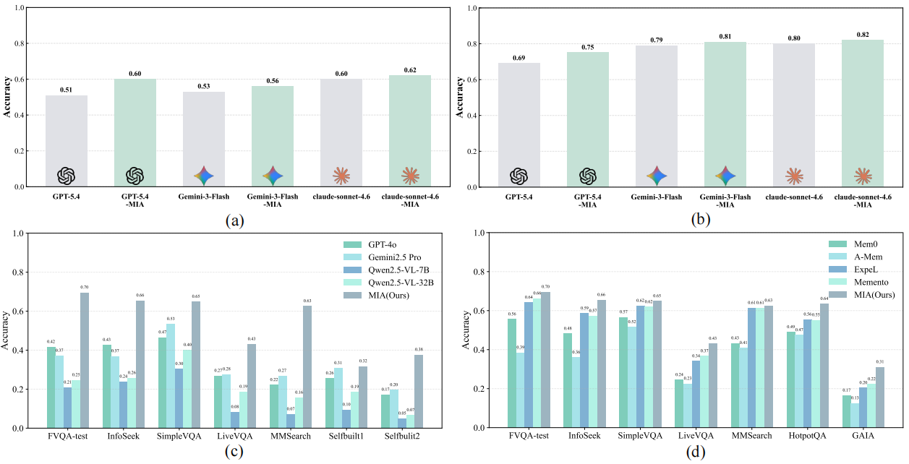

<h1 align="center">
  <br>Memory Intelligence Agent
</h1>
<div align="center">


[](https://arxiv.org/pdf/2604.04503) [](https://huggingface.co/LightningCreeper/MIA) [](https://huggingface.co/datasets/LightningCreeper/MIA) [](https://www.python.org/downloads/release/python-3100/) [](https://opensource.org/licenses/MIT) [](https://sii-group.com/fr-FR/sii-sud-ouest)

[[英文](./README.md)] [[中文](./README_CN.md)]

</div>

<p align="center"><i>一个专为深度研究型智能体设计的记忆框架</i></p>

## 🚀 新闻
- **[April 3, 2026]**:  🦞 OpenClaw MIA技能现已正式登陆Clawhub。立即下载，体验智能记忆体的魅力！
- **[April 1, 2026]**:  🌈 全栈已发布。完整的训练与评估代码、模型及数据集均已同步上线。欢迎查阅！

## 📌 简介
你是否厌倦了那些“无所不知”却“毫无记忆”的深度研究型智能助手？你的助手是否在海量长篇文字中难以集中注意力？你是否因嘈杂且无关紧要的记忆而导致推理失败而感到沮丧？你是否发现由于计算成本飙升以及不断增长的上下文历史所带来的复杂问题，导致你的智能助手的记忆能力受损？最重要的是：你的智能助手是否只是死记硬背“结果是什么”，却完全无法学习“如何”得出这个结果？如果是这样的话，那正撞上了当前智能体记忆的“南墙”。本质上，已有的记忆框架更像是一个“平庸的规划器”从“臃肿的记忆库”里胡乱捞取碎片，试图用“词不达意的提示词”去指挥一个“毫无准备的执行器”进行深入研究。

**MIA (Memory In Intelligence Agent)** 是由**上海创智学院(SII)**与**华东师范大学(ECNU)** 联合团队开发的一种新型的深度研究记忆智能体框架。MIA旨在将智能体从“被动的记录者”转变为“主动的策略制定者”，用一套复杂的“管理者-规划者-执行者”架构取代了混乱的“记忆备份”：

- **管理者**：终极管理员，优化记忆存储以消除冗余。
- **规划者**：战术性大脑，不仅能够针对当前问题制定研究计划，还能通过测试时的持续学习实时调整其策略。
- **执行者**：经过训练的执行专家，能够毫无阻碍地解读并遵循复杂的研究蓝图。

🌟 **核心亮点**
- 🧬 **从“堆量”到“进化”**：MIA让智能体跳出“上下文越长越好”的怪圈，转向策略导向的智慧。通过构建参数化与非参数化记忆的协作闭环，智能体能在复杂多变的开放世界中实现自主进化。
- 🔬 **RL同步驱动**：借助交替强化学习范式，MIA打破了静态记忆的死板，让管理者、规划者与执行者三位一体、无缝衔接，实现丝滑多智能体协作。
- 🧠 **智能动态进化**：拒绝“出厂即巅峰”！MIA搭载持续测试时学习机制，让规划者在推理过程中就能边做边学，实时优化科研路径。

## 🏆 性能

<h1 align="center"></h1>

**📥 实验结论**
- **SOTA性能再突破(a & b)**：在**LiveVQA**(多模态在线搜索)与**HotpotQA**(纯文本沙盒搜索)的对比实验中，MIA显著**提升了现有最先进LLMs（GPT-5.4, Gemini-3-Flash, claude-sonnet-4.6）的表现**，证明了其在多维任务中的普适增强能力。
- **实现小尺寸模型的跨级超越(c)**：基于Qwen-2.5-VL-7B执行器的MIA模型在7个核心数据集上表现卓越。实验证明，MIA助力7B模型实现了质的性能飞跃，其**表现超越了GPT-5.4，GPT-4o和Gemini-2.5-Pro（不调用搜索工具），逼近了Gemini-3-Flash（不调用搜索工具）** 等顶级闭源大模型。
- **记忆方法的新标杆(d)**：在与当前最先进的智能体记忆方法的横向评测中，MIA在全部7个数据集上均取得最佳性能，有力证明了其在记忆演化上的卓越性。

## 🦞 OpenClaw技能

我们也提供了两个基于MIA的OpenClaw技能版本: [纯净版本](https://clawhub.ai/jingyangqiao/mia)和[可信版本](https://clawhub.ai/sii-yucheng2002/mia-trust)，它们不仅整合了MIA存储框架，还包含了基于可信驱动的校正机制。以下是MIA存储和可信的演示示例。

**存储示例：**

<div align="center">
  <video src="https://github.com/user-attachments/assets/2fee2be1-3731-4a41-b22d-4f9c1567226e" />
</div>

<div align="center">
  <video src="https://github.com/user-attachments/assets/332693a8-c229-4e2c-b542-ca0a0356dda3" />
</div>

**可信示例：**

<div align="center">
  <video src="https://github.com/user-attachments/assets/21c6ef9d-b502-40ca-93e2-a3a5d7a5d06f" />
</div>

## 🛠️ 工具

### 1. 在线文本搜索 💻
核心实现主要在 `web_tools/server` 中。
打开`web_tools/run.sh`，配置谷歌搜索serper key
```bash
export SERPER_KEY_ID="xxxxx"
```
启动运行脚本
```bash
cd web_tools
bash ./run.sh
```
服务 `SERVICE_URL/server`，方法 `SERVICE_URL/server/search`

### 2. 离线文本搜索 📖
核心实现主要在 `local_search` 中。
参照[search-r1](https://github.com/PeterGriffinJin/Search-R1/blob/main)里面的搭建方式，本项目使用的是[wiki25](https://huggingface.co/datasets/XLDDD/wiki25)本地检索。
配置路径，启动运行脚本
```bash
cd local_search
bash ./run.sh
```
服务 `http://localhost:8001/`，方法 `http://localhost:8001/retrieve`

### 3. 图搜图 🎨

项目使用的图像搜缓存：[image_search_cache](https://huggingface.co/datasets/LightningCreeper/MIA/tree/main/image_search_cache)

## ⚙️ 环境
```bash
conda create -n verl python==3.10.12
```
执行train中的install.sh脚本安装依赖.
flash-attention需要单独安装
``` bash
wget -nv https://github.com/Dao-AILab/flash-attention/releases/download/v2.8.3/flash_attn-2.8.3+cu12torch2.7cxx11abiFALSE-cp310-cp310-linux_x86_64.whl
pip install --no-cache-dir flash_attn-2.8.3+cu12torch2.7cxx11abiFALSE-cp310-cp310-linux_x86_64.whl
```

## 🧬 数据准备

训练：🤗 [Train](https://huggingface.co/datasets/LightningCreeper/MIA/tree/main/Train)

测试：🤗 [Test](https://huggingface.co/datasets/LightningCreeper/MIA/tree/main/Test), 🤗 [TTRL](https://huggingface.co/datasets/LightningCreeper/MIA/tree/main/TTRL)


## ✨ 两阶段RL训练

### ⚡ Executor训练

我们的实现基于VeRL，主要修改部分：
交互核心实现主要在 `/Executor-Train/Train/verl/experimental/tool_agent_loop.py` 中。
`prompt` 定义在 `/Executor-Train/Train/local_search/prompt.py` 中。
自定义数据集处理 (`CustomRLHFDataset`)、奖励评分计算 (`compute_score`)在 `Executor-Train/Train/local_search/mmsearch.py` 中。
工具实现在 `verl.tools.search_tool.SearchTool`，`verl.tools.web_image_to_image_search_tool.WebImageToImageSearchTool` 。
运行脚本在 `/Executor-Train/Train/local_search/run_mmsearch_grpo.sh` 中。
**1.** 部署本地文本搜索工具

**2.** 配置 `/Executor-Train/Train/local_search/mm_search_tool_config.yaml` 与 `/Executor-Train/Train/local_search/mmsearch.yaml`：
- `mm_search_tool_config.yaml`
   - `tools[0].config.retrieval_service_url`: 本地搜索服务
   - `tools[1].config.fvqa_train_cache_path`、`tools[1].config.test_cache_path`: 测试集与验证集的图像搜索缓存路径
- `mmsearch.yaml`
   - `hydra.searchpath`: trainer配置路径
   - `data.custom_cls.path`: 自定义数据集代码路径
   - `actor_rollout_ref.rollout.multi_turn.tool_config_path`: 工具配置`mm_search_tool_config.yaml`路径

**3.** 在节点1上部署Qwen3-32B作为 `Planner & Judger` ：
``` bash
export VLLM_USE_FLASHINFER_SAMPLER=0
CUDA_VISIBLE_DEVICES=0,1,2,3 \
vllm serve /your_path/Qwen/Qwen3-32B \
    --tensor-parallel-size 4 \
    --served-model-name "qwen" \
    --gpu-memory-utilization 0.8 \
    --host 0.0.0.0 \
    --port 8002
```
LLM服务 `your_url/8002/v1`

**4.** 部署 `Memory-Planner` 服务，可以与`Planner & Judger`在同一节点
``` bash
cd Memory-Serve
cd TRAIN_PLANNER
```

配置运行脚本 `run.sh`: `MEMORY_URL` 与 `PLAN_URL` 全部设置为上一步部署的LLM服务。
为了提升训练效率，`memory content` 与 `initial plan` 是提前收集好的，这里只需要拿到`replan`的服务：`your_url/5000/replan_train`。

**5.** 配置训练脚本 `/Executor-Train/Train/local_search/run_mmsearch_grpo.sh`
- `JUDGE_URL`: `judge`服务，填 `your_url/8002/v1`
- `REPLAN_URL`: `replan`服务，填 `your_url/5000/replan_train`
- `WANDB_API_KEY`: WandB API 密钥（可选）
- `SAVE_CHECKPOINT_DIR`: 模型保存路径
- `DATASET_TRAIN`: 训练数据集路径
- `DATASET_VAL`: 验证数据集路径
- `REF_MODEL_PATH`: 预训练模型路径

**6.** 在节点2上启动训练
打开 `/Executor-Train/Train/` 目录
```bash
bash ./local_search/run_mmsearch_grpo.sh
```

**7.** 导出模型
```bash
python -m verl.model_merger merge \
    --backend fsdp \
    --local_dir /your_path/actor \
    --target_dir /your_path
```

我们训练的 `Executor` 🤗 [下载](https://huggingface.co/LightningCreeper/MIA/tree/main/Trained-Executor)

### ⚡ Planner训练

我们的实现基于VeRL，主要修改部分：
交互核心实现主要在 `/Planner-Train/mem-plan/verl/experimental/multi_turn_loop.py` 中。
`prompt` 定义在 `/Planner-Train/mem-plan/local_search/prompt.py` 中。
自定义数据集处理 (`CustomRLHFDataset`)、奖励评分计算 (`compute_score`)在 `/Planner-Train/mem-plan/local_search/mmsearch.py` 中。
运行脚本在 `/Planner-Train/mem-plan/local_search/run_mmsearch_grpo.sh` 中。

**1.** 在节点1上部署 `Judger` 服务：
``` bash
export VLLM_USE_FLASHINFER_SAMPLER=0
CUDA_VISIBLE_DEVICES=0,1,2,3 \
vllm serve /your_path/Qwen/Qwen3-32B \
    --tensor-parallel-size 4 \
    --served-model-name "qwen" \
    --gpu-memory-utilization 0.8 \
    --host 0.0.0.0 \
    --port 8002
```

**2.** 在节点2上部署Executor服务：

部署训练好的Executor：
``` bash
export VLLM_USE_FLASHINFER_SAMPLER=0
CUDA_VISIBLE_DEVICES=0,1,2,3 \
vllm serve /your_path/Executor \
    --tensor-parallel-size 4 \
    --served-model-name "qwen" \
    --gpu-memory-utilization 0.8 \
    --host 0.0.0.0 \
    --port 8002
```
打开 `/Serve/Train_Planner`，配置运行脚本 `serve.sh`:
- `AGENT_URL`: Executor服务的URL
- `SERVICE_URL`: 文本搜索（离线）服务的URL
- `TEST_CACHE_DIR`: 图搜图缓存路径
- `MAX_LLM_CALL_PER_RUN`: Executor与工具交互的最大轮数

启动
``` bash
bash serve.sh
```

**3.** 配置训练脚本 `/Planner-Train/mem-plan/local_search/run_mmsearch_grpo.sh`

- `JUDGE_URL`: `judge`服务，填 `your_url/8002/v1`
- `PLAN_URL`: 对`plan`进行响应的`Executor`服务，填 `your_url/5000/plan`
- `REPLAN_URL`: 对`replan`进行响应的`Executor`服务，填 `your_url/5000/replan`
- `WANDB_API_KEY`: `WandB API` 密钥（可选）
- `SAVE_CHECKPOINT_DIR`: 模型保存路径
- `DATASET_TRAIN`: 训练数据集路径
- `DATASET_VAL`: 验证数据集路径
- `REF_MODEL_PATH`: 预训练模型路径

为了提升训练效率，`memory content` 与 `image caption` 是提前收集好的。

**4.** 在节点3上启动训练
打开 `/Planner-Train/mem-plan/` 目录
```bash
bash ./local_search/run_mmsearch_grpo.sh
```

**5.** 导出模型
```bash
python -m verl.model_merger merge \
    --backend fsdp \
    --local_dir /your_path/actor \
    --target_dir /your_path
```

我们训练的 `Planner` 🤗 [下载](https://huggingface.co/LightningCreeper/MIA/tree/main/Trained-Planner)

## 🔍 推理

- [Base](./readme_cn/Base.md)

- [RAG](./readme_cn/RAG.md)

- [mem0](./readme_cn/mem0.md)

- [a-mem](./readme_cn/a-mem.md)

- [Expel](./readme_cn/Expel.md)

- [ReasoningBank](./readme_cn/ReasoningBank.md)

- [Memento](./readme_cn/Memento.md)

- [ours (no TTRL)](./readme_cn/MIA.md)

- [ours (no TTRL and no GT)](./readme_cn/MIA-nogt.md)

## 💡 TTRL

**1.** 在节点1上部署 `Memory Manager & Judger` 服务：
``` bash
export VLLM_USE_FLASHINFER_SAMPLER=0
CUDA_VISIBLE_DEVICES=0,1,2,3 \
vllm serve /your_path/Qwen/Qwen3-32B \
    --tensor-parallel-size 4 \
    --served-model-name "qwen" \
    --gpu-memory-utilization 0.8 \
    --host 0.0.0.0 \
    --port 8002
```

**2.** 在节点2上部署Executor服务：
``` bash
export VLLM_USE_FLASHINFER_SAMPLER=0
CUDA_VISIBLE_DEVICES=0,1,2,3 \
vllm serve /your_path/Executor \
    --tensor-parallel-size 4 \
    --served-model-name "qwen" \
    --gpu-memory-utilization 0.8 \
    --host 0.0.0.0 \
    --port 8002
```
打开 `/Serve/MIA-TTRL`，配置运行脚本 `serve.sh`:
- `AGENT_URL`: `Executor`服务的`URL`
- `SERVICE_URL`: 文本搜索（离线/在线）服务的`URL`
- `TEST_CACHE_DIR`: 图搜图缓存路径
- `MAX_LLM_CALL_PER_RUN`: `Executor`与工具交互的最大轮数
- `MEMORY_URL`: `Memory Maneger`服务的`URL`
- `TTRL_SAVE`: 探索期间输出路径
- `PARQUET_PATH`: 带图像测试集路径（带图像数据集需填写）

其中，在 `/Serve/MIA-TTRL/call_agent.py` 对文本搜索的设置（请选择其中一个）：
``` python
from tool_search_local import *   # 离线文本搜索
from tool_serper import *   # 在线文本搜索
```

切换 `/Serve/MIA-TTRL/serve.sh` 运行的python代码，修改模式（有监督/无监督）：
``` bash
python agent_serve_ttrl.py ....   # 每个问题结束后可以拿到Ground-Truth的场景
python agent_serve_ttrl_nogt.py ....   # 每个问题结束后无法拿到Ground-Truth的场景
```

**3.** 配置脚本 `/TTRL/TTRL/local_search/run_mmsearch_grpo.sh`（有监督），`/TTRL/TTRL-nogt/local_search/run_mmsearch_grpo.sh`（无监督）：

- `JUDGE_URL`: `judge`服务，填 `your_url/8002/v1`
- `MEMORY_URL`: 读取记忆服务，填 `your_url/5000/memory`
- `PLAN_URL`: 对`plan`进行响应的`Executor`服务，填 `your_url/5000/plan`
- `REPLAN_URL`: 对`replan`进行响应的`Executor`服务，填 `your_url/5000/replan`
- `MEMORY_BANK_SAVE_URL`: 向缓存区存储记忆服务（当前批次探索未完成），填 `your_url/5000/memory_bank_save`
- `BATCH_EVALUATE_URL`: 对当前批次样本进行评估的服务，填 `your_url/5000/batch_evaluate`
- `CONSOLIDATE_MEMORIES_URL`: 提取所有缓存区样本记忆的服务，填 `your_url/5000/consolidate_memories`
- `SAVE_MEMORIES_URL`: 保存全部记忆的服务，填 `your_url/5000/save_memory`
- `WANDB_API_KEY`: `WandB API` 密钥（可选）
- `SAVE_CHECKPOINT_DIR`: 模型保存路径
- `DATASET_TRAIN`: 数据集路径
- `DATASET_VAL`: 无效，与`DATASET_TRAIN`相同即可
- `REF_MODEL_PATH`: 初始Planner路径

启动
``` bash
bash serve.sh
```

**4.** 在节点3上启动`Planner`服务
打开 `/TTRL/TTRL/` 或 `/TTRL/TTRL-nogt/` 目录
```bash
bash ./local_search/run_mmsearch_grpo.sh
```

## ⚖️ 许可

该项目遵循MIT许可协议发布。

## 🎓 感谢以下对项目做成贡献的团队成员

**博士研究生:** 孟炜程, 程宇, 林志航

**学生负责人:** 乔静阳

**项目组成员:** 张志忠, 谭鑫, 龚靖渝, 殷赵霞

**项目负责人:** 谢源

## 🎯 下一步计划

我们即将发布:

1. 高效版本的MIA代码仓库
2. 可信版本的MIA代码仓库

<a href="https://www.star-history.com/?repos=ECNU-SII%2FMIA&type=date&legend=top-left">
 <picture>
   <source media="(prefers-color-scheme: dark)" srcset="https://api.star-history.com/image?repos=ECNU-SII/MIA&type=date&theme=dark&legend=top-left" />
   <source media="(prefers-color-scheme: light)" srcset="https://api.star-history.com/image?repos=ECNU-SII/MIA&type=date&legend=top-left" />
   
 </picture>
</a>
